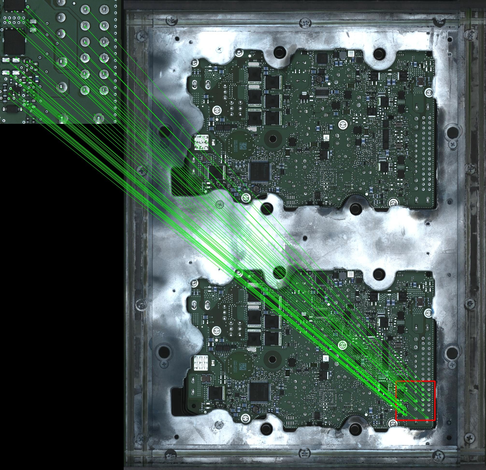

# SIFT Matching
SIFT based feature matching for image localization

SIFT: Scale Invariant Feature Transform   
FLANN: Fast Library for Approximate Nearest Neighbors

## Procedure
1. Feature point generation using SIFT -> keypoint with descriptor
2. FLANN based feature matching
3. Estimate Homography using RANSAC based outlier filtering
4. Perspective transformation of the small part image into whole image to locate area.

## Result example
</img>
